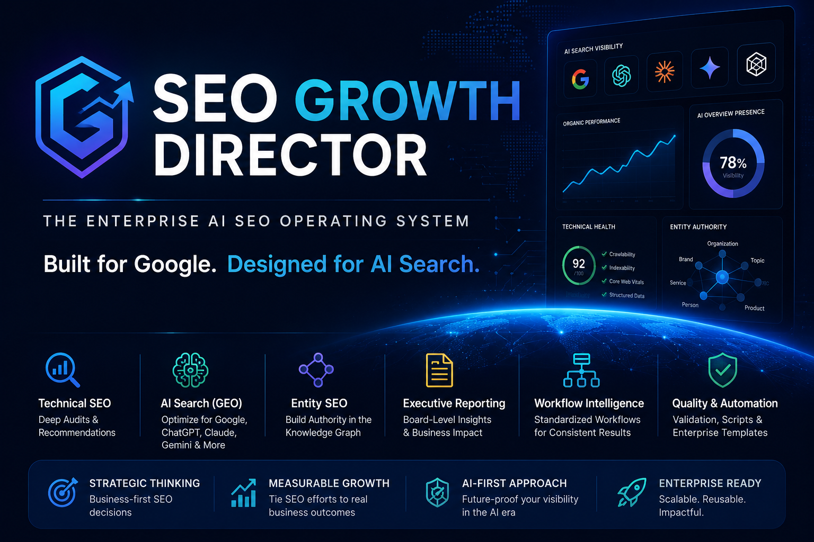

<div align="center">
<p align="center">
  
</p>

# 🚀 SEO Growth Director

### Enterprise AI SEO Operating System for Claude

**Technical SEO • AI Search (GEO) • Entity SEO • Executive Reporting • Workflow Intelligence**

<p align="center">
Enterprise-grade SEO strategy powered by Claude Skills, designed for agencies, enterprises, consultants, founders and AI-first marketing teams.
</p>

---


</div>

---

# 🌍 Vision

SEO is evolving beyond traditional search.

Google AI Overviews, ChatGPT, Claude, Gemini, Copilot and Perplexity are transforming how users discover information.

**SEO Growth Director** is built to help businesses optimize not only for search engines, but also for AI-powered search experiences through enterprise-grade workflows, technical SEO, AI Search Optimization (Generative Engine Optimization), Entity SEO and executive-level decision support.

Unlike traditional SEO prompts, this project functions as an **AI Operating System** that thinks like an Enterprise SEO Director.

---

# 🎯 Objectives

- Deliver enterprise-grade SEO strategy
- Optimize for both Google Search and AI Search
- Standardize SEO audits through reusable workflows
- Produce executive-ready reports
- Improve consistency across SEO deliverables
- Bridge Technical SEO, Content Strategy and AI Search
- Enable scalable SEO consulting using Claude Skills

---
# Why SEO Growth Director Exists

Traditional SEO tools generate reports.

Traditional AI prompts generate answers.

**SEO Growth Director is different.**

It is designed as an **Enterprise AI SEO Operating System** that combines strategic thinking, technical SEO, AI Search Optimization (GEO), Entity SEO, workflow automation, and executive reporting into one structured system.

Instead of answering questions in isolation, the skill follows enterprise-grade workflows, loads specialized knowledge, applies standardized templates, validates outputs through quality gates, and delivers recommendations tied directly to measurable business outcomes.

The objective isn't to create another SEO assistant.

The objective is to replicate how an experienced Enterprise SEO Director thinks, prioritizes, and communicates.

---

## Problems It Solves

Modern SEO has become significantly more complex.

Businesses now need to optimize across:

- Google Search
- Google AI Overviews
- ChatGPT
- Claude
- Gemini
- Microsoft Copilot
- Perplexity

Most existing SEO workflows still focus only on rankings.

SEO Growth Director expands beyond rankings by integrating:

- Technical SEO
- Content Strategy
- Entity SEO
- AI Search Optimization (GEO)
- Executive Reporting
- Business Impact Analysis
- Workflow Intelligence
- Implementation Roadmaps

---

## Enterprise-First Philosophy

Every recommendation follows five principles:

1. Business outcomes over rankings
2. Technical excellence before content scaling
3. AI Search readiness alongside traditional SEO
4. Executive communication instead of technical jargon
5. Long-term authority instead of short-term tactics

---

## Built for Modern SEO Teams

SEO Growth Director is suitable for:

- Enterprise organizations
- SEO agencies
- Growth marketing teams
- Fractional CMOs
- Digital consultants
- Startup founders
- Technical SEO specialists
- Content strategists
- AI-first marketing teams

---

## What Makes This Different

Unlike generic SEO assistants, this project includes:

- Structured workflows
- Knowledge-driven decision making
- Resource loading logic
- Enterprise reporting standards
- AI Search frameworks
- Entity SEO methodology
- Quality validation scripts
- Reusable templates
- Modular architecture
- Continuous versioning

This makes SEO Growth Director a reusable SEO operating system rather than a collection of prompts.
# ✨ Enterprise Feature Matrix

SEO Growth Director combines traditional SEO, AI Search Optimization, workflow intelligence and executive reporting into a single enterprise-ready system.

| Capability | Included |
|------------|:---------:|
| Technical SEO Audits | ✅ |
| AI Search Optimization (GEO) | ✅ |
| Entity SEO | ✅ |
| Semantic SEO | ✅ |
| Content Strategy | ✅ |
| Keyword Research | ✅ |
| Competitor Analysis | ✅ |
| Local SEO | ✅ |
| Ecommerce SEO | ✅ |
| Website Migration Planning | ✅ |
| Executive Reporting | ✅ |
| SEO Roadmaps | ✅ |
| AI Overview Optimization | ✅ |
| Knowledge Graph Optimization | ✅ |
| Workflow Intelligence | ✅ |
| Quality Validation | ✅ |
| Enterprise Templates | ✅ |
| Reusable Audit Framework | ✅ |
| Business Impact Analysis | ✅ |
| Priority Matrix | ✅ |
| Success Metrics Framework | ✅ |

---

# 🧠 Enterprise Capabilities

The SEO Growth Director currently includes the following enterprise modules.

### Technical SEO

- Crawlability Analysis
- Indexability Analysis
- XML Sitemap Validation
- Robots.txt Review
- Canonical Analysis
- Core Web Vitals
- Structured Data
- Internal Linking
- URL Architecture
- Redirect Analysis

---

### AI Search

- Google AI Overviews
- ChatGPT Visibility
- Claude Visibility
- Gemini Visibility
- Microsoft Copilot
- Perplexity
- Generative Engine Optimization (GEO)

---

### Entity SEO

- Organization Entity
- Person Entity
- Brand Entity
- Product Entity
- Service Entity
- Location Entity
- Topic Entity
- Knowledge Graph Optimization

---

### Content Intelligence

- Search Intent
- Topic Clusters
- Content Gap Analysis
- Topical Authority
- E-E-A-T Evaluation
- Content Refresh Planning

---

### Enterprise Reporting

- Executive Summary
- Business Context
- Technical Findings
- Business Impact
- Priority Matrix
- Implementation Roadmap
- Success Metrics
- Board-Level Reporting

---

## 📊 Designed For

- Enterprise Organizations
- SEO Agencies
- Growth Teams
- Digital Consultants
- Fractional CMOs
- Founders
- Marketing Leaders
- Technical SEO Specialists
# 🏗 Enterprise Architecture

SEO Growth Director follows a workflow-driven architecture rather than a traditional prompt-based approach.

```text
                    USER REQUEST
                         │
                         ▼
          Business Objective Detection
                         │
                         ▼
          Workflow Selection Engine
                         │
                         ▼
             Knowledge Base Loader
                         │
        ┌────────────────┼────────────────┐
        ▼                ▼                ▼
   References         Examples        Templates
        │                │                │
        └────────────────┼────────────────┘
                         ▼
             Execution Scripts Layer
                         │
        ┌────────────────┼────────────────┐
        ▼                ▼                ▼
 Quality Check      Priority Matrix   AI Search Logic
                         │
                         ▼
          Executive Output Generator
                         │
                         ▼
            Enterprise SEO Deliverable
```

---

## System Components

| Layer | Purpose |
|--------|----------|
| Identity Layer | Defines the Enterprise SEO Director persona |
| Workflow Layer | Selects the appropriate enterprise workflow |
| Knowledge Layer | Loads SEO principles and AI Search frameworks |
| Scripts Layer | Executes workflow selection and quality validation |
| Examples Layer | Maintains consistent deliverable quality |
| Templates Layer | Standardizes enterprise outputs |
| Output Layer | Produces executive-ready deliverables |

---

## Design Principles

The architecture is based on five core engineering principles:

- Workflow-first instead of prompt-first
- Knowledge-driven reasoning
- Modular resource loading
- Enterprise quality validation
- Executive-focused communication

This modular architecture allows the skill to scale without becoming a large, unstructured prompt.
---

# 🔄 Workflow Intelligence Engine

Unlike traditional AI prompts, SEO Growth Director never jumps directly to an answer.

Every request follows a structured enterprise workflow.

```text
User Request
      │
      ▼
Business Objective Detection
      │
      ▼
Workflow Classification
      │
      ▼
Knowledge Loading
      │
      ▼
Reference Selection
      │
      ▼
Template Selection
      │
      ▼
Execution Scripts
      │
      ▼
Quality Validation
      │
      ▼
Executive Output
```

## Workflow Sequence

1. Detect business objective
2. Classify SEO problem
3. Select workflow
4. Load references
5. Load examples
6. Load templates
7. Execute reasoning
8. Validate quality
9. Generate executive deliverable

---

## Available Workflows

| Workflow | Purpose |
|-----------|----------|
| Technical SEO | Enterprise technical audits |
| Content Strategy | Content planning & optimization |
| Keyword Research | Search opportunity discovery |
| Competitor Analysis | Market intelligence |
| AI Search (GEO) | AI visibility optimization |
| Entity SEO | Knowledge Graph optimization |
| Local SEO | Local business growth |
| Website Migration | SEO-safe migrations |
| Executive Reporting | Board-ready reporting |
---

# 🚀 Installation

SEO Growth Director is designed to work with **Claude Desktop**, **Claude Code**, and **Claude CoWork**.

## Requirements

- Claude Desktop
- Claude Code (optional)
- Claude CoWork (optional)
- Git
- GitHub

---

## Installation

### Step 1

Clone the repository.

```bash
git clone https://github.com/dheerajsukumar/seo-growth-director.git
```

---

### Step 2

Open the project.

```bash
cd seo-growth-director
```

---

### Step 3

Locate the Claude Skill.

```text
.claude/
└── skills/
    └── seo-growth-director/
```

---

### Step 4

Open Claude Desktop.

Navigate to:

Settings

↓

Skills

↓

Upload Skill

Select:

```text
.claude/skills/seo-growth-director
```

---

### Step 5

Restart Claude Desktop.

The skill is now available.

---

# ⚡ Quick Start

Ask Claude:

```text
Use the seo-growth-director skill.

Perform a complete enterprise SEO audit.
```

Or

```text
Use the seo-growth-director skill.

Build a 90-day SEO roadmap.
```

Or

```text
Use the seo-growth-director skill.

Review my AI Search visibility.
```

Within seconds, Claude will automatically:

- Detect your business objective
- Select the appropriate workflow
- Load the required knowledge
- Apply enterprise templates
- Execute validation
- Produce an executive-ready deliverable
---

# 💬 Example Prompts

Below are examples of how to interact with SEO Growth Director.

## Technical SEO

```text
Use the seo-growth-director skill.

Perform a complete Technical SEO Audit for https://example.com

Include:

• Crawlability
• Indexability
• Core Web Vitals
• Structured Data
• Internal Linking
• Priority Matrix
• Executive Summary
```

---

## AI Search (GEO)

```text
Use the seo-growth-director skill.

Analyze my website for AI Search visibility.

Evaluate:

• Google AI Overviews
• ChatGPT
• Claude
• Gemini
• Perplexity
• Entity SEO

Provide an Executive GEO Report.
```

---

## Content Strategy

```text
Use the seo-growth-director skill.

Build a complete topical authority strategy for my website.

Include:

• Topic Clusters
• Pillar Pages
• Supporting Content
• Internal Linking
• E-E-A-T Recommendations
```

---

## Executive SEO Report

```text
Use the seo-growth-director skill.

Create a board-level Executive SEO Report.

Include:

• Business Summary
• Technical Risks
• SEO Opportunities
• Revenue Impact
• 90-Day Roadmap
• KPI Dashboard
```

---

## Competitor Analysis

```text
Use the seo-growth-director skill.

Compare my website against my top three competitors.

Identify:

• Keyword Gaps
• AI Search Visibility
• Entity Coverage
• Content Opportunities
• Technical Advantages
```

---

## Website Migration

```text
Use the seo-growth-director skill.

Prepare a complete SEO Migration Plan.

Include:

• Redirect Strategy
• Crawl Validation
• Canonical Review
• XML Sitemap
• QA Checklist
• Rollback Plan
```

---